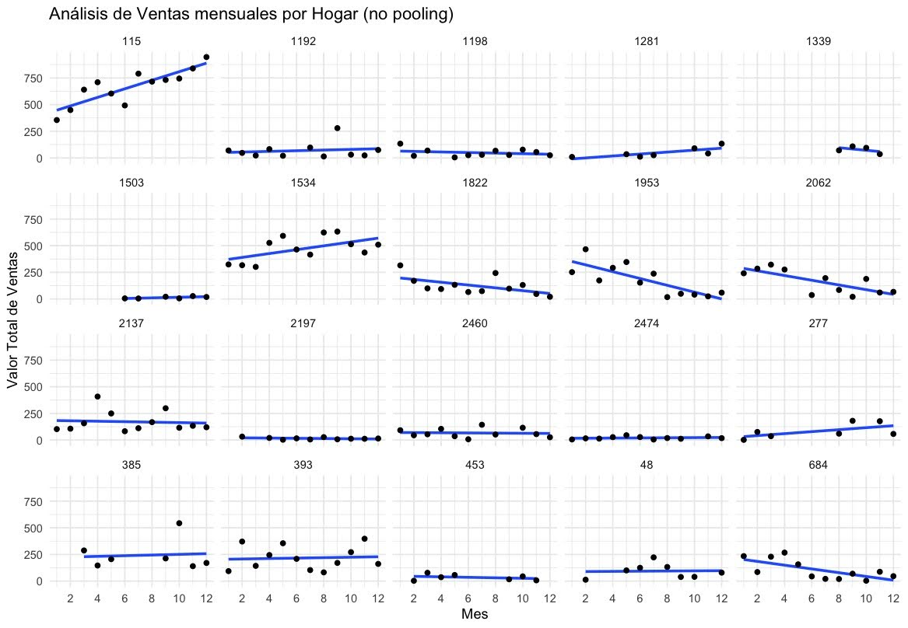

# Análisis de ventas mensuales mediante Modelos Lineales Mixtos - aplicación en R para datos longitudinales

## Descripción del Proyecto

Este proyecto tiene como objetivo analizar datos longitudinales de transacciones y demografía del paquete completejourney utilizando **Modelos Lineales Mixtos (Mixed Linear Models)** en R siendo este el fin de estudiar datos longitudinales de las compras realizada por hogares (households) a una cadena de supermercados (retail) a lo largo de los meses, datos que provienen del paquete `completejourney` de R. Se emplean diversas librerías especializadas para la manipulación y visualización de datos, así como para la construcción y evaluación de modelos estadísticos avanzados. En el repositorio se incluye el Informe obtenido con los resultados más relevantes. Cabe acotar que es un proyecto de Modelos Lineales y los resultados obtenidos son mayormente para fines académicos, se adjunta igualmente el objeto final RData para cargar y correr el código.

### **Objetivos Principales:**

- **Carga y Exploración de Datos:** Importación de conjuntos de datos de demografía y transacciones, seguido de una exploración inicial para comprender su estructura y detectar valores faltantes.
  
- **Visualización de Ventas:** Creación de gráficos que representan las ventas totales mensuales, la distribución del tamaño de los hogares y otras variables clave, utilizando `ggplot2` y otras herramientas de visualización.
  
- **Transformación y Preparación de Datos:** Conversión de variables a factores, agrupación de datos por mes y hogar, y muestreo de hogares para análisis detallados.
  
- **Construcción de Modelos Estadísticos:** Desarrollo de diferentes modelos lineales y mixtos para analizar el impacto de variables como el mes, ingresos y tamaño del hogar en las ventas totales. Esto incluye modelos de **no pooling**, **complete pooling** y **partial pooling**.
  
- **Evaluación y Validación de Modelos:** Cálculo de métricas de desempeño como el **RMSE** (Root Mean Squared Error), análisis de residuos para verificar supuestos del modelo, y comparación de distintos modelos utilizando criterios como el **R²**.
  
- **Análisis de Efectos Aleatorios:** Visualización e interpretación de los efectos aleatorios por hogar mediante gráficos de intervalos de confianza y **BLUPs** (Best Linear Unbiased Predictors).
  
- **Pruebas de Robustez:** Implementación de modelos robustos para manejar posibles atípicos y verificar la estabilidad de los resultados obtenidos.

### **Tecnologías y Librerías Utilizadas:**

- **R:** Lenguaje principal para el análisis de datos y modelado estadístico.
- **Librerías Principales:**
  - `lme4`, `lmerTest`, `robustlmm` para modelos lineales mixtos.
  - `dplyr`, `tidyr` para manipulación de datos.
  - `ggplot2`, `corrplot`, `GGally` para visualización de datos.
  - `caret` para validación cruzada y evaluación de modelos.
  - `broom.mixed` para resumir y organizar los resultados de los modelos.
  - `completejourney` para cargar los conjuntos de datos de transacciones y demografía.

Un pequeño ejemplo de lo obtenidos en este análisis se presenta a continuación basado en https://www.r-bloggers.com/2017/06/plotting-partial-pooling-in-mixed-effects-models/:

No pooling: Ajuste de un modelo lineal simple sin efectos aleatorios.

Complete pooling: Modelo lineal mixto con un efecto aleatorio para cada hogar.

Partial pooling: Modelo lineal mixto con efectos aleatorios y fijos para hogares.
